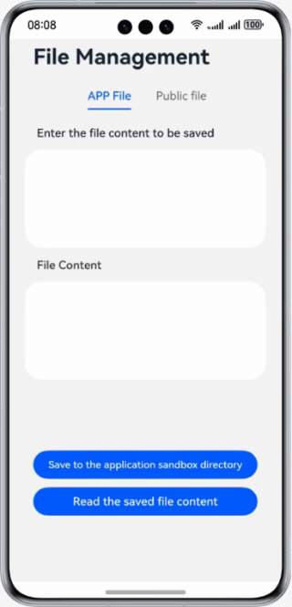

# Files Manager

## Introduction

Learn how to implement file management, including saving and reading app files, reading user files and images, and reading and saving TXT files.  

## Concepts

- Files manager: provides APIs for file operations, including accessing and managing files and directories, obtaining file information, and reading and writing data using streams. (**@ohos.file.fs**)
- Picker: encapsulates APIs such as **PhotoViewPicker**, **DocumentViewPicker**, and **AudioViewPicker** for you to pick and save files. (**@ohos.file.picker**)
- Photo manager: provides the photo management capabilities, including creating an album, and accessing and modifying media data in the album. (**@ohos.file.photoAccessHelper**)
- PhotoViewPicker: allows you to pick and save images and videos.
- DocumentViewPicker: allows you to pick and save documents in different formats.

## Permissions

N/A

## How to Use

1. Enter the content in the text box and tap **Save to the application sandbox directory**. Create a sandbox file for saving the information.
2. Tap **Read the saved file content** to read the content saved in the sandbox file.
3. Tap **Save image** to save the image to Gallery.
4. Tap the image to be added. Switch to Gallery and pick an image to display.
5. Enter the content in the text box and tap **Save the test.txt file to the user directory**. Switch to the file manager page, create a file, and save the content.
6. Tap **Read the test.txt file content**. Switch to the file directory and pick the file to read.

## Constraints

1. The sample is only supported on Huawei phones with standard systems.
2. HarmonyOS: HarmonyOS 5.0.0 Release or later.
3. DevEco Studio: DevEco Studio 5.0.0 Release or later.
4. HarmonyOS SDK: HarmonyOS 5.0.0 Release SDK or later.
